<!--
  Theme: Cyberpunk + Creative Junior
  Palette: cyan (#22D3EE) · magenta (#FF006E) · violet (#A371F7) on GitHub dark (#0d1117)
  Generated for: David Veryutin / davids199005-oss
-->

<div align="center">


<br>

<a href="mailto:davids199005@gmail.com"></a>
<a href="https://www.linkedin.com/in/david-veryutin-1990h"></a>
<a href="https://github.com/davids199005-oss"></a>
<a href="https://www.npmjs.com/~davids90"></a>

<br><br>


🎓 <b>ECOM School</b> — AI Developer (Python · ML · DL · NLP) · 427 hrs<br>
🎓 <b>John Bryce College</b> — Full Stack & GenAI (JS/TS · Node.js · React · GenAI Agents) · 830 hrs<br>
🎓 <b>Udemy</b> — Python Full Course (Django · Data Science · ML) · 45.5 hrs

</div>


##  Featured Projects

<table>
<tr>
<td width="33%" valign="top">

<h3 align="center">🦉 Project Athena</h3>
<div align="center">
<a href="https://github.com/davids199005-oss/Project-Athena"></a>
<br><br>
<p><b>AI-Powered Reading Platform</b></p>
<p>Book catalog · EPUB/PDF reader · RAG-based AI chat over book content · Real-time streaming · OAuth · Admin panel</p>
<br>


</div>

</td>
<td width="33%" valign="top">

<h3 align="center">💭 Inkstream</h3>
<div align="center">
<a href="https://github.com/davids199005-oss/Inkstream"></a>
<br><br>
<p><b>AI Chat with Streaming Responses</b></p>
<p>Modern web client · OpenAI-backed API · Real-time SSE streaming · Async chat history · Clean architecture with typed contracts end-to-end</p>
<br>


</div>

</td>
<td width="33%" valign="top">

<h3 align="center">✈️ Vacanza</h3>
<div align="center">
<a href="https://github.com/davids199005-oss/Vacanza"></a>
<br><br>
<p><b>Full-Stack Travel Platform</b></p>
<p>Vacation booking · AI recommendations via GPT-4o-mini · MCP server integration · Admin panel with charts & CSV · Dockerized with Nginx</p>
<br>


</div>

</td>
</tr>
<tr>
<td width="33%" valign="top">

<h3 align="center">📦 Xpressify</h3>
<div align="center">
<a href="https://www.npmjs.com/package/xpressify"></a>
<br><br>
<p><b>Modern CLI for Express + TypeScript Projects</b></p>
<p>Scaffold production-ready Express APIs (ESM · helmet · cors · rate-limit) · Generators for routes / middleware / DTOs / tests · Optional zod / jwt / docker / pino</p>
<br>


</div>

</td>
<td width="33%" valign="top">

<h3 align="center">📊 CryptoGraph</h3>
<div align="center">
<a href="https://davids199005-oss.github.io/CryptoGraph/"></a>
<br><br>
<p><b>Crypto Analytics Dashboard</b></p>
<p>Real-time market data · Coin details · Chart reports · AI-powered buy/sell recommendations</p>
<br>


</div>

</td>
<td width="33%" valign="top">

<!-- placeholder cell to keep 3-column grid -->

</td>
</tr>
</table>


##  Tech Stack

<div align="center">

<h3>💬 Languages</h3>

<a href="https://skillicons.dev"></a>

<h3>🎨 Frontend</h3>

<a href="https://skillicons.dev"></a>
<br><br>

<h3>⚙️ Backend</h3>

<a href="https://skillicons.dev"></a>
<br><br>

<h3>🤖 AI & GenAI</h3>


<h3>📊 ML / Data Science</h3>

<a href="https://skillicons.dev"></a>
<br><br>


<h3>🗄️ Databases</h3>

<a href="https://skillicons.dev"></a>

<h3>🔗 ORM & Validation</h3>

<a href="https://skillicons.dev"></a>
<br><br>


<h3>🔐 Security</h3>


<h3>🐳 DevOps & Infrastructure</h3>

<a href="https://skillicons.dev"></a>

<h3>📡 Realtime</h3>


<h3>🧰 Workflow & AI Tools</h3>

<a href="https://skillicons.dev"></a>
<br><br>


</div>


## 🌃 About Me

<sub align="center"><i>~/.config/claude/mcp_servers.json</i></sub>

<div align="center">

```json
{
  "mcpServers": {
    "david-veryutin": {
      "command": "developer",
      "args": [
        "--stack=full-stack-genai",
        "--location=haifa,IL",
        "--utc-offset=+2/+3",
        "--mode=production-grade"
      ],
      "env": {
        "CURRENTLY_LEARNING": "C#, ASP.NET Core, MCP",
        "BUILDING": "indie-saas (stealth mode) 🚀",
        "FUEL": "☕ black coffee · 🎧 Deep House",
        "MOTTO": "ship small, ship often, ship production-grade",
        "OPEN_TO": "startups, Web3, creative-tech, AI/ML teams"
      },
      "autoApprove": ["clean-architecture", "type-safety", "SOLID", "KISS"],
      "disabled": false
    }
  }
}
```

</div>


## 🌍 Languages I Speak

<div align="center">


</div>


## 💬 Top Languages by Volume

<div align="center">

<a href="https://github.com/anuraghazra/github-readme-stats"></a>

<br>

<sub><i>Calculated by GitHub from bytes of source code in public non-forked repositories — reflects code volume, not skill proficiency.</i></sub>

</div>


<div align="center">

## 💬 Open to Opportunities


<br><br>

🚀 Open to <b>office · remote · hybrid</b> · Haifa & Tel Aviv area + remote worldwide<br>
⚡ Aiming for <b>startups · Web3 · creative tech · AI/ML teams</b>

<br>

<a href="mailto:davids199005@gmail.com"></a>
<a href="https://www.linkedin.com/in/david-veryutin-1990h"></a>
<a href="https://github.com/davids199005-oss"></a>

</div>

<br>


