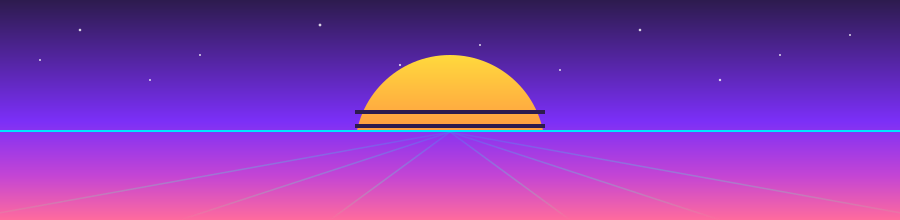

<!--
  Theme: Retro Synthwave / 80s
  Palette: sunset pink #FF6B9D -> magenta #C445D4 -> violet #7B2FF7 -> cyan #00E5FF
  Background: #1a0b2e (deep space)
  For: David Veryutin / davids199005-oss
  Assets: profile/synthwave-horizon.svg (custom)
  Animations: capsule-render, readme-typing-svg, github-readme-stats, streak, Platane/snk, skillicons
-->

 

  

<!-- SYNTHWAVE HORIZON DIVIDER (custom asset: profile/synthwave-horizon.svg) -->

## ◆ &nbsp;About

<samp>

I build software end to end — backends, frontends, APIs, and the data
underneath. My work leans on **clean architecture**, strict type safety, and
solid engineering practice. I care about production-grade code, not demos.

**Software Developer** &nbsp;·&nbsp; Haifa, IL &nbsp;·&nbsp; UTC +2 / +3

</samp>

## ◆ &nbsp;Tech Stack

**LANGUAGES**

**BACKEND**

**AI / ML** &nbsp;

 

**DATA &amp; MESSAGING**

**FRONTEND**

**DEVOPS**

## ◆ &nbsp;Featured Projects

<table>
<tr>
<td width="50%" valign="top">

### 🦉 Project Athena

**AI-Powered Reading Platform**
RAG chat over book content · EPUB/PDF reader · real-time streaming · OAuth · admin panel.

</td>
<td width="50%" valign="top">

### 💭 Inkstream

**AI Chat with Streaming Responses**
OpenAI-backed API · real-time SSE · async history · typed contracts end-to-end.

</td>
</tr>
<tr>
<td width="50%" valign="top">

### ✈️ Vacanza

**Full-Stack Travel Platform**
Vacation booking · GPT-4o-mini recs · MCP server · admin panel · dockerized.

</td>
<td width="50%" valign="top">

### 📦 Xpressify

**CLI for Express + TypeScript APIs**
Scaffold production-ready Express APIs · generators for routes / middleware / DTOs / tests.

</td>
</tr>
</table>

Also: <a href="https://cryptograph-7f18a.web.app/Home/">CryptoGraph</a> — crypto analytics dashboard (React · TS · Redux · OpenAI)

## ◆ &nbsp;Stats

  

 
<i>Top languages reflect code volume by bytes in public non-forked repos, not proficiency.</i>

## 🐍 &nbsp;Contribution Snake

<!--
  Generated by .github/workflows/snake.yml (Platane/snk). Won't render until the
  workflow has run once (push it, then run manually from the Actions tab).
  Commits SVGs to the "output" branch.
-->

## ◆ &nbsp;Languages I Speak

 

## 🎯 &nbsp;Open to Work

<samp>Haifa &amp; Tel Aviv area + remote worldwide</samp>

 

